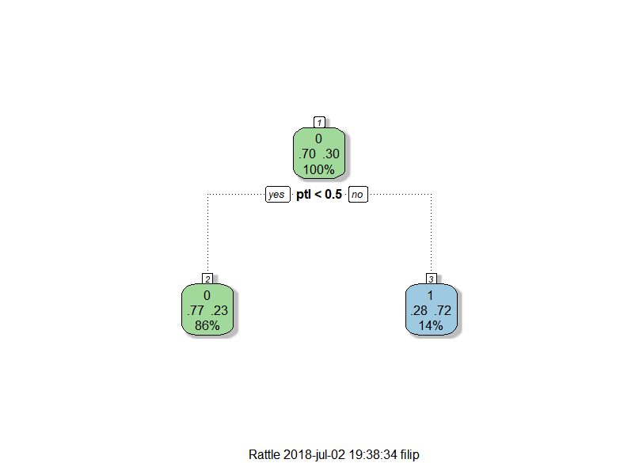
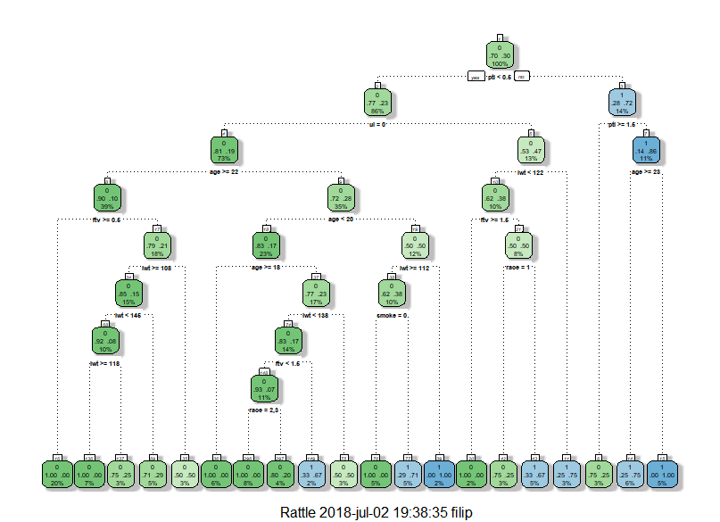
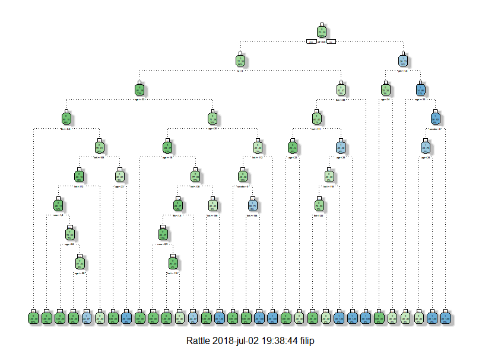

## Carregando os dados
```{r}
library(knitr)
library(rpart)
load("lesson4_birthwt.RData")
```
O objetivo é prever se um bebê nascerá com baixo peso (menos que 2,5Kg). 
Os dados trazem informações sobre a mãe, o peso de bebês o nascer e o marcador "low", quando o peso é menor que 2,5Kg.

## Visualizando os dados
````{r}
head(bw)
````
````{r}
str(bw)
````
````{r}
summary(bw)
````
````{r, echo=FALSE}
hist(bw$bwt)
````

## Dividindo os dados em Treinamento e Teste
A fim de testar o precisão do modelo a ser construido, será utilizado dois grupo aleatórios do dados. O primeiro, com 70% das observações, será utilizado para o "treinamento" do modelo e o segundo, com 30% das observações, para testar sua precisão.

```{r}
set.seed(123)
train.index <- sample((nrow(bw)),0.7*nrow(bw))
train <- bw[train.index,]
test  <- bw[-train.index,]
```

## Construindo a árvore de decisão
```{r}
fit_1 <- rpart(low ~ age + lwt + race + smoke + ptl + ht + ui + ftv,
             data=train,
             method="class")
```


## Checando a precisão do modelo
```{r}
prediction_1 <- predict(fit_1, test, type = "class")
table1 <- prop.table(table(prediction_1,test$low))
table1
```
```{r}
accuracy1 <- table1[1,1]+table1[2,2]
accuracy1
```

## Identificando os parâmetros do modelo para melhorá-lo
```{r}
parameters.fit_1 <- list(minsplit=fit_1$control$minsplit, 
                         minbucket=fit_1$control$minbucket, 
                         cp=fit_1$control$cp,
                         variable.importance=fit_1$variable.importance)
parameters.fit_1
```

## Testando uma árvore maior
```{r}
fit_2 <- rpart(low ~ age + lwt + race + smoke + ptl + ht + ui + ftv,
             data=train, method="class",
             minsplit = 10, minbucket = 3, cp=-1)

#fancyRpartPlot(fit_2)
```


## Checando a precisão do modelo
```{r}
prediction_2 <- predict(fit_2, test, type = "class")
table2 <- prop.table(table(prediction_2,test$low))
table2
```
```{r}
accuracy2 <- table2[1,1]+table2[2,2]
accuracy2
```

## Testando com uma grande árvore
```{r}
fit_5 <- rpart(low ~ age + lwt + race + smoke + ptl + ht + ui + ftv,
               data=train, method="class",
               minsplit = 2, minbucket = 2, cp =-1)

#fancyRpartPlot(fit_5)
```


## Checando a precisão do modelo
```{r}
prediction_5 <- predict(fit_5, test, type = "class")
table5 <- prop.table(table(prediction_5,test$low))
table5
```
```{r}
accuracy5 <- table5[1,1]+table5[2,2]
accuracy5
```

